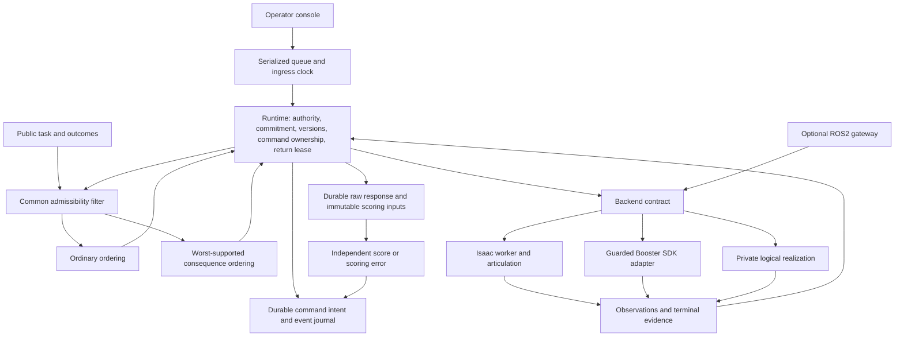

# Implementation architecture

## Scope and boundaries

This release makes the proposed sequencing mechanism executable against a common backend contract: deterministic task model, two schedulers, serialized runtime, operator console, durable journals, independent response scoring, native Isaac arm control, ROS2 gateway, and guarded Booster SDK adapter. It does not infer human attention or beliefs, train a policy, implement balance, or prove physical safety.

The standard K1 has four joints per arm and no actuated gripper in the pinned model. The implemented task is named endpoint reaching A → B → home with explicit local selections between reaches. “Pointing” means reaching an endpoint associated with a label; a finger ray hitting an object is not verified. The logical fixture has scheduler choice but no physics. The K1 integration scenario has measured motion but no competing useful operations. Keep these claims separate.

ROS is an alternative transport into a backend, not a second concurrent command owner. The runtime test uses HTTP; the ROS test separately exercises DDS and native completion. Neither is a safety channel.

## Task model and choice

`TaskSpec` contains canonical facts, decision categories, a finite dependency graph, skill preconditions, continuous invariants, read/write footprints, resources, duration bounds, outcome support and scoring rules. Validation rejects nonfinite values, invalid dependencies and rubric dependencies absent from `scored_facts`. Semantic equality distinguishes Boolean values from numbers.

A commitment requires deliberate acknowledgement; it is not inferred memory or proof of understanding. Authority is separately granted over named skills with identity, revision and expiry. Attention changes, responses and acknowledgement never expand it. Fact versions change on semantic change, not freshness refresh. Execution ownership remains in the active command even while observations advance.

Both policies receive the same admissible set after dependency, precondition, freshness, invariant, authority-lifetime, resource, common-hold and urgency checks. Ordinary ordering uses priority and stable ID. The consequence policy evaluates supported semantic successors at their branch duration bounds, takes the lexicographically worst vector for each skill, then minimizes it with common tie breaks. The order is evidence demand, action revision, planned context advance. `upper_envelope` is an explicit comparison. The [mathematical model](MATHEMATICAL_MODEL.md) supplies equations and the distinguishing counterexample.

The scheduler is work-conserving **among commonly admissible skills, outside common holds**. It never fills an empty set by widening authority. Missing local work, unresolved faults or absent authority can leave a run incomplete. Deadline priorities are heuristics, not schedulability proofs. The declared bound must cover dispatch, motion, verification/dwell and termination allowance; an overrun latches a fault and requests stop. This Python runtime is not hard real-time enforcement.

## Dispatch, evidence and recovery

1. Re-read the backend and recheck guards. Another motion owner, changed backend boot identity, stale connection or unowned motion latches a fault.
2. Commit a unique intent, canonical payload hash, dependencies, supported effects, reservations and in-flight write markers before I/O. Temporary bookkeeping unknowns are not predicted semantic successors for policy cost.
3. Send a named skill. Acceptance is intermediate; SDK return or elapsed duration cannot credit completion.
4. Match terminal evidence to one supported outcome's declared effects, terminal status, command correlation, age and current observations. Preserve partial/unmodeled effects without crediting completion. Observed terminal quiescence is required.
5. Release the execution slot only after terminal reconciliation. Link loss, ambiguous dispatch, authority expiry, invariant loss and excessive duration remain latched. Read-only reconciliation never clears faults or retries motion.

The core permits one active atomic skill. Resource and write footprints make exclusion explicit; concurrent arm execution is not implemented. Sensor refresh cannot release the active slot or complete work. Adapter deduplication and local ledgers do not prove exactly-once physical action or exclusive DDS ownership.

A nonempty runtime journal raises `RecoveryRequired` on restart. Audit and inspect recorded/backend state before creating a new run. Worker commands become unresolved/unknown across a worker boot, retaining evidence. No recovery path automatically resends motion. The hash chain detects inconsistent edits; it is not security against someone able to rewrite the entire journal.

## Return decisions, clocks and scoring

A cue starts the deadline immediately, including drain delay. New conflicting starts stop under the same rule in both policies. Publication requires backend quiescence, local stability attestation, valid authority and current scored evidence. The frozen object is a decision record, not the physical world. Local attestation does not independently verify assembly correctness.

The browser acknowledges display after a render callback. Server publication and acknowledgement receipt are separate timestamps. Reported rendering is not proof of perception or understanding. An agent exercising the browser is QA, not a human participant, even though the console uses the human input protocol.

Complete authenticated HTTP requests enter one condition-protected FIFO. Admission and timer claims share its lock. Admitted responses precede subsequently claimed timers; a timer already claimed uses its earlier timestamp. Response ingress must lie in `[cue, deadline)`, after publication and, in human mode, after display acknowledgement. Exact-deadline input is late. Bounded backend I/O may delay processing: report queue delay, cue-to-ingress, drain, publication and rendering separately. This is operational timing, not pure human decision time.

The first response binds a stable decision ID and lease ID. Raw contents, detached snapshot/rubric inputs and the first-response claim commit before independent scoring. A score or `scoring_error` follows; scoring failure cannot erase participation. Identical duplicates return their existing result; changed payloads are rejected. Responses never actuate the robot or complete local work. Subsequent commands still require fresh guards. Join capture and score events by decision ID; `return_closed` can initially carry `response_captured`.

Scored changes, expiry, stability/authority loss or unowned motion invalidate a lease as a technical outcome. Late contradictory observations can flag retrospective coherence uncertainty without rewriting the response as human error. Current execution checks still use current evidence.

## Observation and deployment limits

Isaac has one physics owner. Source timestamps advance with physics; dwell resets on missing, regressing or excessive gaps. HTTP reads cannot manufacture samples. Clock conversion subtracts source age and full RTT, providing conservative ages rather than synchronized clocks. Native tests use a single simulator source, 0.5 s observation lifetime, configured source/wall gap bounds and a static support scene. Receipts retain source/configuration hashes.

The physical adapter combines low-state callback times and kinematic transform RPCs. They are not atomic multisensor measurements; the inspected SDK lacks a trusted low-state acquisition timestamp. A deployment must establish latency, clock uncertainty, sensor skew, sample gaps and invalidation-detection latency. The generic runtime does not prove those bounds. One authoritative source per fact is assumed; multisensor fusion is future work.

A commissioning monitor must establish workcell readiness, stable support, identity and effective command ownership. A host lock, receipt or UI Boolean cannot exclude other DDS publishers. A robot-local watchdog and stale-session rejection must enforce control below the experiment process, including bypass channels. Authorized vendor stabilization differs from competing task commands. Hardware stays disabled until these device-specific gates are met; see [hardware integration](HARDWARE_INTEGRATION.md).

## Next research increment

Build a no-grasp task with at least two independent useful remote reach/inspection operations and tangible local work consuming a remote observation. Instrument target identity with a separately validated camera or fixture sensor. Publish the observation model and failure support before policy comparisons; verify bidirectional task dependencies and equal authority/return holds. Run feasibility pilots before a participant study. The sequential engineering example cannot establish cooperative scheduling benefit.
