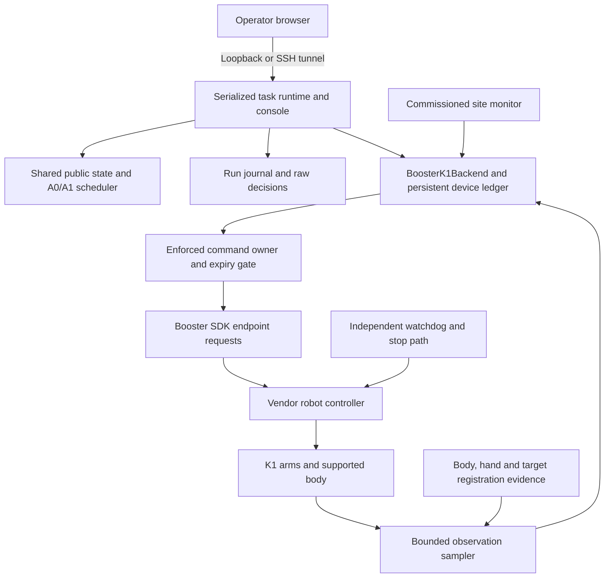

# Booster K1 hardware implementation and test specification

**Current implementation delta:** see [Physical release status](PHYSICAL_RELEASE_STATUS.md)
for the 24 September software gates, offline regressions and actual SDK mismatch.
The backlog below remains the acceptance specification; its required physical
commissioning evidence has not been established by implementing software.

**Revision:** 0.1, September 23, 2026. **Target:** standard Booster K1, initially one arm executing named reaching endpoints, with Isaac Sim as the integration reference. **Status:** implementation and commissioning specification; physical operation has not been validated.

This document defines the work needed to run the existing transition-aware shared-autonomy framework on a real K1. It gives the deployment architecture, software contracts, missing implementation, calibration records, acceptance tests, and operator procedure. The physical backend exists, but it is a guarded prototype. Filling in three poses and enabling its configuration flag is insufficient to commission it.

The first hardware milestone is a measured **A → B → home** sequence with explicit local selections, return snapshots, and recorded decisions. The later research milestone adds multiple useful admissible operations so that the two sequencing policies can actually differ. Neither milestone requires grasping, walking, a learned balance policy, or low-level torque control.

## 1. How to use this specification

1. Run the existing hardware-free checks in Section 12 and preserve their results.
2. Implement the release blockers in Section 9 using the contracts in Sections 4–8. Write their failure-path tests before enabling a physical path.
3. Complete the site and calibration worksheet in Section 3. Install and validate observation-only operation before arming.
4. Follow the staged acceptance campaign in Sections 13–15, advancing only when that stage's evidence passes its declared criteria.
5. Use Section 16 to decide whether the apparatus is ready for a scheduling experiment rather than merely an integration demonstration.

**Status labels:** **Existing** means present in this checkout; **Required** means work or evidence still needed for hardware release; **Proposed** means a suggested implementation interface, not an available command. A commissioning requirement is not a result. No hardware command is executed by this document.

Jump to the [interfaces](#4-shared-software-contracts), [implementation backlog](#9-release-blocking-implementation-backlog), [existing commands](#12-commands-that-work-in-the-current-checkout), [test stages](#13-staged-hardware-acceptance-campaign), [acceptance matrix](#14-acceptance-and-fault-injection-matrix), or [first-session runbook](#15-first-complete-hardware-session).

### Existing implementation and evidence

| Component | Current state | Transfer boundary |
|---|---|---|
| Public facts, versions, acknowledgment, authority, DAG and A0/A1 selection | Existing [model](../src/transition_autonomy/model.py), [scheduler](../src/transition_autonomy/scheduler.py) | Reuse task semantics; hardware evidence must satisfy the same contracts. |
| Runtime, return leases, independent scoring and event journal | Existing [runtime](../src/transition_autonomy/runtime.py), [scoring](../src/transition_autonomy/scoring.py), [journal](../src/transition_autonomy/journal.py) | Reuse one serialized owner and measured completion. New physical timing/fault paths need conformance tests. |
| Operator console | Existing [web implementation](../src/transition_autonomy/web.py) | Loopback HTTP, explicit operations and display acknowledgments; no hardware arm operation or independent emergency stop. |
| Native Isaac worker and adapter | Existing; bounded fixed-root right-arm integration verified | Its pose, timing and stop receipts establish simulation behavior only. |
| `BoosterK1Backend` / `BoosterSDKTransport` | Existing [physical adapter](../src/transition_autonomy/backends/booster_backend.py); fake-transport tests | No physical K1 run, commissioned profiles, device ownership service or production launcher. |
| ROS 2 JSON gateway | Existing for `logical` and `isaac` | It does not select the physical backend. Its current clock contract is same host. |
| Test baseline | 133 local tests passed after the manuscript review's completion-order fix | Earlier 132-test Linux and native integration receipts predate that fix. Rerun against the exact release candidate. |

See [validation evidence](VALIDATION.md), [the local completion-fix receipt](../artifacts/paper-audit-runtime.json), and [the hardware API note](HARDWARE_INTEGRATION.md). This specification adds deployment requirements; it does not expand the scope of those existing results.

## 2. Deployment architecture

Use one commissioned Linux control host for the runtime, physical adapter, SDK and their monotonic clock. It can be an approved onboard computer or a dedicated nearby computer on the approved robot control network. Select its OS/Python/architecture only after confirming the pinned wheel and vendor controller compatibility. The existing Ubuntu 24.04/Python 3.12 simulator host is a useful development environment, not an automatic hardware compatibility endorsement.



The owner gate, bounded sampler, site monitor, watchdog integration and hardware launcher are **Required**, not presently supplied services. Vendor stabilization may continue underneath task commands in its commissioned mode. The scheduler does not assume control of balance or silently switch control modes.

### Process and network responsibilities

| Surface | Requirement |
|---|---|
| Experiment process | Owns task state, authority, scheduling, return scoring and journals. It must not be the only component capable of terminating motion. |
| SDK worker / sampler | Receives state, handles bounded SDK operations, and publishes immutable samples with timing provenance. A blocked SDK call must not block the watchdog or independent stop path. |
| Device owner / watchdog | Rejects stale owners and expired work at the actual command boundary; prevents competing task producers, including bypass paths. A second thread in the experiment process does not meet the process-death requirement. |
| Operator display | Access through local HTTP or authenticated SSH forwarding. UI Pause, Revoke and Close have distinct semantics from the site's emergency stop. |
| ROS 2 | Optional integration layer after direct-backend commissioning. Keep runtime and gateway on the same host initially. ROS discovery isolation is not command authentication or ownership. |
| Robot control network | Explicitly identify the robot, bind the intended interface/address, and separate experiment access from unrelated command clients. Do not reuse a guessed IP, DDS domain, robot name, or simulator ROS domain as a vendor connection setting. |

**One command producer:** choose direct backend or a future physical ROS gateway, never both against the same robot. An SDK demo, teach tool or previous worker is also a producer. Account for authorized vendor stabilization separately from competing arm commands.

Name the actual enforcing component in the deployment record. If the SDK cannot carry owner-epoch/expiry metadata, enforcement must reside in an exclusive commissioned gateway plus demonstrated exclusion of direct writers; call this gateway enforcement, not native robot-side fencing. It must account for already buffered/in-flight SDK work. If late delivery cannot be bounded or rejected and outstanding work cannot be contained, hardware release remains blocked. Stop authority survives task-permit expiry.

## 3. Site inventory and commissioning worksheet

The following values must be recorded for the actual device. A blank or unknown required field is a failed preflight, not permission to use a code default.

| Record | Required contents and evidence |
|---|---|
| Device identity | K1 serial, model string, firmware/controller build, boot identity if available, and dated `GetRobotInfo` response. |
| Control computer | Host ID, OS/kernel, CPU architecture, Python ABI, installed SDK version and wheel SHA-256, dependencies and network configuration. |
| Vendor controller state | Exact permitted mode/body-control values, how an operator establishes them using the approved vendor procedure, and compatible behavior for endpoint commands and stops. No automatic mode transition in the experiment launcher. |
| Physical support | Approved support/stance arrangement, attachment and load limits, body-motion envelope, inspection record and person responsible for the workcell. A fixed Isaac trunk is not a physical support design. |
| Stop system | Independent device/operator stop mechanism, what it stops or holds, effect on gravity-loaded joints and body support, measured response bounds and reset procedure. Do not assume power removal is the appropriate controlled stop. |
| Ownership | All possible task-command paths, permitted service/robot identities, active ownership epoch, watchdog and lease-expiry behavior, prevention of stale or second publishers. |
| Workcell | Clear arm swept volumes, approved target fixtures, initial posture, sensor placement and an observer with access to the independent stop. |
| Calibration | Body/hand/target frame definitions, units, transform convention, calibration method, errors, validity conditions and profile-set digest. |
| Timing | Callback cadence, acquisition/transport uncertainty, RPC latency, sample gaps, clock reset handling, dispatch budget, stop-detection and settling bounds. |
| Run provenance | Project source hashes, task/configuration/profile hashes, policy and display condition, operator IDs appropriate for local records, date and commissioning receipt identifier. |

The configuration must explicitly state which hand is used. Begin with the right arm to match the integration apparatus, while monitoring both arms. The other arm and the body still affect the permitted workspace and quiescence interpretation.

## 4. Shared software contracts

### 4.1 Keep the public `Backend` boundary

The existing [backend protocol](../src/transition_autonomy/backends/base.py) is:

```text
start(command: SkillCommand, now: float) -> BackendEvent
poll(now: float) -> list[BackendEvent]
observe(now: float) -> Observation
request_stop(now: float) -> None
command_status(command_id: str, now: float) -> BackendEvent | None
```

`start` admits a task command; its return is not proof of movement or task success. `poll` reports independently corroborated terminal effects. `observe` reports current evidence and ownership. `request_stop` requests a stop whose outcome must later be measured. `command_status` reads retained history; it must not dispatch or retry movement.

| Object | Existing fields that must survive transfer |
|---|---|
| `SkillCommand` | `command_id`, `run_id`, `skill_id`, `kind`, `parameters`, `dependency_versions`, `authority_id`, `authority_revision`, `issued_at`, `deadline` |
| `FactUpdate` | `value`, `observed_at`, `valid_until`, `status` (`known`, `unknown`, `conflict`), `source` |
| `BackendEvent` | Correlated `command_id`; `accepted`, `running`, `succeeded`, `failed`, `canceled` or `unknown`; event time, effects, detail and evidence |
| `Observation` | `connected`, `quiescent`, sample time, `boot_id`, facts, active command ID and fault |

The hardware command remains `kind="point"` with **only** `parameters={"profile": "point_a"}`, `"point_b"`, or `"home"`. Raw pose/joint/gain input is not accepted through task or network messages. New profiles or skill kinds require an explicit schema and conformance change.

**Required admission envelope:** `SkillCommand` currently contains an authority ID/revision but no authority expiry or proof, and `K1Transport.move(profile)` receives only the profile. Preserve the external backend interface, but extend the internal trusted transport/gateway boundary with a validated `PhysicalAdmission` record containing the complete command, configuration/profile digest, owner epoch/expiry, current task-grant scope/revision/expiry, permitted operation budget, approved starting-region ID and observation-bundle ID. Resolve grants against the serialized authority service; untrusted callers cannot self-assert expiry or revision. Bind the envelope in durable intent, re-resolve revocation and timing at acceptance/send, and return a correlated gateway receipt. These are proposed project records, not fields understood by the stock vendor RPC. Mere identity correlation is not proof that the robot accepted that request.

### 4.2 Reuse these task semantics

- Keep the same configured slots, categories and public timed outcome supports for a matched policy comparison. The policy must not receive future realized outcomes or hidden simulator/experimenter state.
- The acknowledged context stores detached semantic values/status until another explicit acknowledgment. Refreshing a sensor or rendering a summary does not update that reference or grant authority.
- `local.ready` and `local.selected` remain deliberate local facts. A local readiness attestation is not an independent measurement of assembly correctness.
- Motion acceptance makes `remote.pointed_target` unknown. It becomes known only after the commissioned endpoint postcondition is satisfied. `home` produces known `null`; startup unknown is different from known `null`.
- Successful response capture does not actuate the robot or commit local work. A later motion still needs current authority, dependencies, observations and device readiness.
- A task completes only after supported observed effects **and** terminal quiescence. Semantic facts may change during a failed/partial operation without awarding completion credit.

### 4.3 Existing hardware-specific data

| Class | Fields | Required deployment treatment |
|---|---|---|
| `PointProfile` | `hand`, `position_m`, `orientation_rpy`, `duration_ms`, `target_label`, `position_tolerance_m`, `settling_seconds` | Site-specific, versioned values. Position is torso-relative; V2 orientation convention must be verified. Endpoint reach does not verify pointing direction. |
| `K1Config` | Expected serial/firmware, allowed mode/body-control, profiles, commissioning receipt, physical enable flag, state-age and arm-speed limits | Validate exact types and finite values before constructing the adapter. Receipt equality is currently just string equality. |
| `K1Sample` | Time, identity, mode/body-control, eight arm positions/velocities, hand positions, motor-lost flag, site-ready flag, timestamp source | Extend provenance before physical release as specified below; current fields do not prove atomic sampling. |
| `K1Transport` | `read()`, `move(profile)`, `stop()` | Preserve the mockable boundary. The live transport must establish bounded behavior and isolate ambiguous SDK calls. |

Current defaults `max_state_age=0.25 s` and `max_arm_speed=0.05 rad/s` are prototype values, not validated physical thresholds. The runtime's separate default observation age is `0.5 s`. The release configuration must explicitly assign compatible measured limits rather than inheriting either value unnoticed.

## 5. Vendor SDK boundary and version management

The project inspected `booster_robotics_sdk_python==1.6.3` at official source revision `87a9a26d06a94ddd50968e7576f1170f6fa5a80f`. The inspected CPython 3.12/Linux x86-64 wheel hash and API-inspection scope are in [booster_sdk_evidence.json](booster_sdk_evidence.json). Pin the actual release artifact for the deployment's Python/CPU; a wheel for another ABI or architecture needs its own receipt.

Use the existing V2 endpoint path. The pinned header identifies torso-referenced V2 motion and K1 support; the older endpoint method has different/deprecated orientation handling. `MoveHandEndEffectorV2` and `StopHandEndEffector` return `None` in the inspected Python binding, so a normal return does not expose a measured completion result. [Pinned vendor motion header](https://github.com/BoosterRobotics/booster_robotics_sdk/blob/87a9a26d06a94ddd50968e7576f1170f6fa5a80f/include/booster/robot/b1/b1_loco_client.hpp).

The existing transport explicitly constructs `ChannelFactory`, `B1LocoClient` and `B1LowStateSubscriber`. Import alone does not connect. The SDK's low-level publishers and high-level RPC client are distinct interfaces; selecting a domain or taking a host file lock does not arbitrate every publisher. [Vendor communication architecture](https://docs.booster.tech/docs/developer-guide/cpp/architecture/).

**Connection setting ambiguity:** the project's constructor calls its argument `network_interface`; vendor material uses both IP-address and interface/address terminology. Record a value demonstrated to bind the intended NIC with the pinned binding. Do not assume an example name such as `eth0`, an arbitrary IP, or an empty autodetection value is correct. Verify robot identity before enabling a motion-capable service.

Do not run vendor demo initialization as part of preflight. In particular, controller wrappers or examples can enable custom upper-body control, switch modes or command walking. Use a dedicated observation-only path that has no movement method exposed. Preserve any newer vendor documentation as supplementary evidence; it does not silently upgrade the installed SDK or prove compatibility with the site's firmware.

For example, the official ROS2 RPC example invokes walking and the now-deprecated API 2012 (`SwitchHandEndEffectorControlMode`); it is not a preparation script for this experiment. The official interface package is named `booster_interface`, but no inspected source establishes an installed K1 `FollowJointTrajectory`/MoveIt/ros2_control driver for this project. [Pinned ROS2 example](https://github.com/BoosterRobotics/booster_robotics_sdk_ros2/blob/5f9182e1a1b704f65e0065c83a3b6be2d066f3b3/booster_ros2_example/rpc_client/src/client.py), [pinned deprecation](https://github.com/BoosterRobotics/booster_robotics_sdk/blob/87a9a26d06a94ddd50968e7576f1170f6fa5a80f/include/booster/robot/b1/b1_loco_client.hpp#L606-L620).

## 6. Observation, geometry and timing specification

### 6.1 Observation sampler: required additions

The existing transport timestamps low-state callbacks with host `time.monotonic()`, then performs separate identity, status and two hand-transform RPCs. This is a **callback receipt timestamp**, not the sensor acquisition time of every field. The SDK transform is model-derived kinematics, not independent external endpoint metrology.

Implement an immutable sample bundle containing at least:

| Field group | Required information |
|---|---|
| Identity | Robot identity, adapter/worker boot epoch, monotonic sample sequence, owner epoch |
| Joint evidence | All required indexed arm positions and velocities, motor-lost state, callback receipt time; source sequence/time if actually provided and verified |
| RPC evidence | Request start and response end for each transform/status/identity query; declared acquisition semantics if known |
| Timing uncertainty | Earliest/latest plausible acquisition time, clock-conversion uncertainty, age bound, sample gap, transform/joint skew or explicit unknown |
| Provenance | Native velocity versus derived velocity, frame/model/calibration digest, raw source fields, validity and fault reason |
| Site readiness | Structured monitor result with issuer, epoch, timestamp, expiry and failed conditions; reduce to the legacy Boolean only after validating this record |

A fixed-rate sampler may cache expensive identity/configuration data within an explicitly bounded validity period, while immediately invalidating on reconnect/boot or incompatible status. Runtime observations should consume a bounded immutable cache rather than synchronously making several unbounded SDK calls. Measure the delivered rate under load; the console's nominal 50 ms tick is not a guaranteed robot monitor period.

For evidence component `x`, define a conservative acquisition interval `[t_x_minus, t_x_plus]` in the control host clock. At decision time `t`, require:

```text
age_upper(x) = t - t_x_minus <= allowed_age(x)
bundle_skew_upper = max_x(t_x_plus) - min_x(t_x_minus) <= allowed_skew
```

Receipt time can support these bounds only if acquisition/transport delay has a defensible bound. Assigning the callback time to earlier measurements does not establish that bound. If the bound is unknown, retain the raw observation for diagnostics and refuse decisions requiring certified freshness/coherence. A process/clock epoch change invalidates the bundle; do not compare raw monotonic timestamps across hosts or reboots.

Generated sample IDs prove receiver events, not advancing sensor acquisition: buffered or replayed stationary packets remain a required test. RPC request/response times bracket the call, not necessarily acquisition of a cached returned measurement. Establish source progression or justified buffering/acquisition-age bounds before using either as dwell evidence. Refresh processing time after bounded acquisition rather than judging a newly received callback against an older entry timestamp.

Apply this consistently at every runtime/adapter return boundary: refresh the live evaluation clock after bounded I/O, including terminal verification, or use an explicitly defined cache snapshot whose publication time is no later than the caller's supplied time. The choice must be consistent in the implementation and tests. Do not modify an observation's timestamp just to prevent a future-time rejection. Record call-entry, sample/acquisition provenance and evaluation time independently.

Record control-host boot/clock epoch and define suspend/resume behavior. The first deployment should inhibit motion before suspend and require revalidation after resume; never carry an armed session, old monotonic deadline or dwell accumulator across a reboot, clock epoch change or uncharacterized suspension.

### 6.2 Endpoint and target registration

Use explicit transforms, e.g. `T_world_body` and `T_body_hand`, with stated direction and units. A torso-relative endpoint is:

```text
p_world_hand = T_world_body * p_body_hand
```

The target's world pose and the body pose must remain within their registered validity envelope. Hand-in-torso tolerance alone does not prove that the hand still corresponds to world target A if the body sways, a fixture moves or the frame definition is wrong.

Commission each profile with: initial-posture envelope, commanded endpoint and V2 orientation, expected joint/path envelope, swept-volume checks, permitted support condition, duration, endpoint error tolerance, speed threshold, dwell, and target label. Validate the vendor transform against an independent measurement method with recorded uncertainty. That method may be a calibrated camera/fixture measurement; it is a deployment choice, not an existing project sensor.

Commission allowed **transitions**, including A-to-B and B-to-home, rather than checking isolated endpoints alone. An interrupted configuration may lie outside every approved starting region; leave dispatch inhibited and use a separately commissioned recovery procedure. Reaching home is not harmless initialization. K1's four joints per arm do not provide arbitrary independent six-dimensional pose control, so test the required position/orientation combination for each allowed transition. [Official K1 model](https://github.com/BoosterRobotics/booster_assets/blob/3c2dfa99e09beddf092e0d6521dbbcec7e7903ed/README.md).

The SDK arm read order is left indices 2–5 followed by right indices 6–9. Preserve a checked joint-name/index map; the Isaac articulation order and its `aaleft_...`/`aaright_...` names must not be treated as identical array ordering. [Pinned K1 enum](https://github.com/BoosterRobotics/booster_robotics_sdk/blob/87a9a26d06a94ddd50968e7576f1170f6fa5a80f/include/booster/robot/b1/b1_api_const.hpp).

**Do not copy simulation geometry:** the simulator's joint targets, `tool_offset_m`, reference tolerance, fixed trunk and disabled self-collision are particular to that model. Real profiles are calibrated Cartesian endpoint requests to the vendor controller. Matched profile names establish semantic correspondence, not trajectory/dynamics equivalence. Retain `orientation_verified: false` unless a new orientation/directional-pointing postcondition is implemented and independently measured.

### 6.3 Terminal postcondition

For profile `a`, require fresh, valid, advancing samples throughout the measured settling interval:

```text
endpoint_error = norm(p_body_hand_measured - p_body_target[a])
endpoint_error <= position_tolerance[a]
max(abs(all_eight_arm_velocities)) <= commissioned_arm_speed_limit
elapsed_valid_sample_time >= settling_seconds[a]
```

Every constituent sample must satisfy the allowed gap, skew and registration conditions. Reset settling on an out-of-tolerance sample or excessive gap; a repeated cached sample cannot advance dwell. Reject timestamp regression/nonfinite state. Discrete samples support the declared observer and interval bounds, not proof of continuous physical stability between arbitrary samples.

The displayed raw-error predicate describes the current adapter. The commissioned acceptance rule must account for uncertainty, for example `endpoint_error + justified_position_error_bound <= allowed_physical_error`, with corresponding registration and velocity uncertainty terms. Define whether bounds are conservative intervals or statistical coverage statements and validate that choice. When only an uncertain estimate is available, report indeterminate rather than passing at a raw threshold. Choose the adapter's operational tolerance inside the independently justified physical error budget; do not enlarge tolerances retrospectively to pass a trial.

During commissioning, compare native velocity with position changes and independent endpoint evidence. The Isaac workaround for inconsistent native velocity is not automatically justified on hardware. If a derived velocity is used, identify its source, filtering/window, noise, latency and uncertainty and revalidate the thresholds.

Renew `remote.pointed_target` only while the confirmed profile remains valid, the relevant body/fixture registration holds and the observer still supports quiescence. Otherwise publish unknown. At startup, an arm appearing near home does not inherit a prior run's success; either perform an explicitly commissioned bootstrap observation procedure or leave the target unknown until a fresh measured command completes.

Keep observed pose, last completed task target and active command separate. Read-only reconciliation remains possible with an unknown target. Proximity to A must not retrospectively complete the DAG's `point_a` step. Endpoint arrival also does not identify its causal RPC: when native request attribution is unavailable, completion relies on the commissioned exclusive owner and absence of pending competing work plus the measured postcondition. If that attribution is unresolved, preserve the observation but do not award command completion or retry automatically. Include external registration uncertainty in the acceptance budget rather than silently treating model output as ground truth.

### 6.4 Dispatch and stop budgets

Use measured, independently enforced limits for operation admission:

```text
operation_budget = admission_queue + final_check + durable_commit + command_transport
                 + controller_execution + settling + terminal_observation + margin
t_send + remaining_operation_budget <= command_deadline
authority_expiry >= command_deadline
```

The command deadline is not an instruction to let unsafe movement continue until it expires. Profile path limits, site monitoring, ownership and the independent stop path remain active. Recheck at the last boundary before possible actuation after blocking checks/persistence, and enforce expiry close enough to the robot to reject a request that arrives late. A host check followed by unbounded delivery is insufficient.

Measure separately: request-to-controller acceptance, stop request-to-measured arm stillness, stale-data detection, fault-to-stop request, watchdog reaction after process/network loss, and time until new work is inhibited. Bind each to the commissioned physical envelope. Stop/owner leases must be consistent with the supported controller behavior; arbitrary software timeout numbers are not physical stopping guarantees.

Track detection, queueing, persistence and escalation in the stop budget as well. The accepting gateway/controller must reject late work after any allowed buffering interval; a host timeout or cancellation of a thread future does not retract a delivered/running SDK request.

## 7. Ownership, startup, stopping and recovery

### 7.1 Distinguish four permissions

1. **Connection permission:** open the selected SDK observation/RPC channels.
2. **Hardware arm permission:** a commissioned device/profile/site may accept the bounded operation class.
3. **Task authority:** this run's specific skills and lifetime, independently revocable.
4. **Acknowledgment:** the operator explicitly records the presented task context.

None implies the others. `physical_actuation_enabled=True`, the current `commissioning_receipt` string, a UI checkbox, a lock file, and a DDS domain are not proof of exclusive physical ownership.

### 7.2 Required device lifecycle

```text
DISCONNECTED -> OBSERVING -> PREFLIGHT_VALID -> DISARMED_READY
DISARMED_READY -> ARMED_IDLE -> EXECUTING -> ARMED_IDLE
EXECUTING -> STOP_REQUESTED -> STOP_CONFIRMED
any active state -> FAULT_LATCHED / OUTCOME_UNKNOWN -> RECONCILIATION_REQUIRED
```

Treat these as separate state dimensions where necessary: task outcome, measured motion state, fault latch, and arm permission. A stopped robot can still have an unknown task outcome; a latched fault must not prevent observing that it has stopped. No transition from a fault, restart or expired owner automatically arms or replays a command.

Startup order: validate offline configuration and provenance; acquire the device ledger/owner; start observation-only sampling; establish valid site/identity/timing; reconcile previous commands; obtain hardware arm permission; create the new experiment journal and runtime; start the serialized console with automatic dispatch off; then acquire task authority/acknowledgment and deliberately start sequencing. If startup faults before a valid baseline, repair the cause and preserve that attempt's records before beginning a new run.

### 7.3 Required stop behavior

- First stop request records a reason, command/owner IDs and time, disables new motion, and invokes the commissioned planner-stop path.
- Repeated requests are idempotent for that stop episode. They must not reset the settling origin or resend unbounded stop RPCs on every runtime tick.
- Observation and read-only reconciliation continue while dispatch remains faulted. A failed/uncertain stop RPC cannot be reported as `canceled` based on elapsed time.
- Report measured stillness separately from semantic command outcome. Preserve partial/unmodeled effects and any command whose execution remains ambiguous.
- Loss of monitoring, a stuck SDK call or experiment-process death is handled by the independent watchdog/stop mechanism. Console responsiveness is not the stop proof.
- Closing a subscriber, database, Python process or SSH window is not a stop procedure. Do not automatically return home during cleanup; home is another motion requiring current authorization and valid path conditions.

Define a linearization point for stop-versus-success races: a committed successful terminal outcome preceding stop admission remains historical success; if stop/abort is admitted first, later endpoint arrival or an RPC return must not overwrite it with success. Retain measured effects, confirm stopping independently, and classify task outcome as canceled or unknown according to the evidence. Stillness alone cannot release device ownership while an earlier queued/in-flight command remains capable of actuation. The stop/watchdog path must not wait behind a motion RPC, journal lock, failed disk write or shutdown join. Ambiguous shutdown preserves external motion inhibition and the required recovery owner, not merely a warning in a file.

### 7.4 Persistent device history

Use a persistent ledger associated with the robot identity, outside disposable per-run directories, plus a separate experiment journal for each run. The existing example assembly uses an adapter ledger inside a run directory; a production launcher must not let a new folder hide unresolved device history.

Persist intent before the first possible effect, with complete command/configuration/profile and owner epoch. Identical command IDs return retained receipts; different payloads/configurations under the same ID are rejected. A timeout can mean that the command executed. Query retained state/status and obtain physical evidence; do not retry with a fresh ID to make an ambiguous command disappear.

The inspected SDK path does not supply a controller-side command-ID query equivalent to the project ledger. The device ledger therefore cannot establish exactly-once physical action. Restart reconciliation must retain ambiguity, establish measured conditions, fence any previous owner and explicitly decide task state. Never delete an adapter/gateway journal to bypass this gate.

## 8. Hardware configuration and module design

### 8.1 Manifest structure

Use a strict versioned commissioning manifest. The following is a **Proposed schema sketch**, deliberately incomplete and non-actuating. No parser for this full schema ships yet. A `null` value required by the selected stage must fail its preflight; observation-only discovery may record unknown firmware/profile values, but cannot arm or approve them.

```yaml
schema_version: 1
deployment_id: null
robot:
  serial: null
  firmware: null
  model: K1
control_host:
  host_id: null
  os_release: null
  python_abi: null
  cpu_architecture: null
sdk:
  distribution: booster_robotics_sdk_python
  version: 1.6.3
  artifact_sha256: null
  network_binding: null
  vendor_dds_domain: null
  robot_name: null
physical_actuation_enabled: false
controller:
  allowed_mode: null
  allowed_body_control: null
  support_record: null
  independent_stop_record: null
ownership:
  enforcement_record: null
  watchdog_record: null
observation:
  max_age_s: null
  max_gap_s: null
  max_skew_s: null
  max_transport_uncertainty_s: null
  max_arm_speed_rad_s: null
  calibration_digest: null
profiles:
  point_a: null
  point_b: null
  home: null
commissioning:
  receipt_id: null
  manifest_sha256: null
  reviewer: null
  approved_at: null
  expires_at: null
```

Each non-null profile must provide exactly the `PointProfile` fields plus the calibration/path/initial-state envelope in the commissioning record. Enforce `point_a -> "A"`, `point_b -> "B"`, and `home -> null` for the reference task. Reject booleans where numeric scalars are required, NaN/infinity, wrong vector lengths, unknown keys, inconsistent units, mismatched identity/profile hashes and unapproved duration/tolerance limits. Validate `duration_ms` as an integer. Cryptographic hashes identify a reviewed artifact; they do not establish who approved it without a trusted review/authorization mechanism.

Require every profile referenced by the selected task, including all three reference profiles; the current `K1Config` only checks a nonempty subset. Copy the validated profile/configuration data into an immutable representation: a frozen dataclass containing a mutable dictionary is not sufficient. Changes to firmware, identity, geometry, support, calibration, controller mode or stop behavior revoke the associated approval until affected checks are repeated.

Define the digest without self-reference: hash the validated configuration payload **excluding the complete `commissioning` block**. Use UTF-8 canonical JSON with sorted keys, fixed compact separators, a specified escaping/numeric serialization convention, and rejection of duplicate keys/nonfinite values. Version this canonicalization rule. The separate approval record contains the resulting digest, reviewer/issuer, permit class, scope, expiry, revocation and evidence references; the manifest's `commissioning` block is a reference to that record. Verify both the digest and its authorization through the trusted local approval registry. Configuration changes require a new record, not editing the old approval.

### 8.2 Proposed implementation files and responsibilities

These are work items, not currently callable programs.

| Proposed file/module | Responsibility | Completion criterion |
|---|---|---|
| `deployment/k1_preflight.py` | Offline manifest/SDK checks and a separate observation-only diagnostic mode | Structured report; no move/stop/mode-changing method reachable in observation mode; unknown fields fail explicitly. |
| `deployment/k1_monitor.py` | Structured site/owner/support/watchdog observations | Timestamped expiring records with individual reasons and evidence references; failure cannot be replaced by constant `True`. |
| `deployment/k1_observer.py` | Bounded SDK sampler and calibration-aware bundles | Sample sequence/epoch, intervals, gap/skew/age accounting, bounded runtime reads, fault isolation and tests. |
| `deployment/k1_runtime.py` | Serialized assembly, device ledger, runtime/UI lifecycle and explicit arm operation | No actuation by default or on restart; correct absolute clock; deterministic shutdown/recovery evidence. |
| `scripts/validate_k1_hardware.py` | Stage-selected acceptance harness | Only commissioned stages may reach a live command interface; each stage produces complete provenance and a pass/fail/unresolved report. |
| Future physical ROS backend/client integration | Same envelope, ledger and command ownership through ROS | Same-host clock contract or a separately verified conversion protocol; no bypass of the physical gate. |

Do not add a public `--force`, `--ignore-fault`, arbitrary-pose endpoint or config switch that bypasses the commissioning record. The launcher should expose explicit states and failure reasons, not a single misleading “connected” indicator.

### 8.3 Discovery, commissioning and operational permits

Avoid a circular gate in which profile measurements require a release record that those measurements are supposed to create. Use distinct permit classes with different callable capabilities:

| Permit class | Prerequisites | Allowed capability |
|---|---|---|
| Observation/discovery | Locally identified device and approved read-only connection path, no movement methods exposed | Discover and record firmware/mode/timing; unresolved profile/calibration fields remain unresolved. No arm, stop-as-motion-probe, mode change or task authority. |
| Bounded commissioning | Required software fault tests passed; independently established protective stop/support/owner controls; a site-reviewed candidate transition, starting envelope, limits, trial count and expiry | Only the supervised test named by this permit. A profile/stop permit cannot run S5. After the individual transitions pass, a separate integration permit may authorize exactly the fixed S5 sequence and its return protocol. No unrestricted task execution or automatic stage advancement. |
| Operational release | Completed profile/transition, timing, stop, ownership and integration evidence for the exact immutable configuration | Only the specified validated task/profile envelope, under fresh hardware arm and task authority. |

Commissioning is a narrowly scoped alternative authorization, not an override of identity, evidence validity, support or independent protection. An unproven planner stop is measured under an independently established protective arrangement; it must not be the sole protection for its own test. If that prerequisite cannot be established, remain observation-only. A permit expiring or failing inhibits further work and routes to the independent stop/recovery procedure.

## 9. Release-blocking implementation backlog

The following findings come from the current source review. They are intentionally **not marked fixed by writing this specification**.

| ID | Current behavior/gap | Required change and regression |
|---|---|---|
| H01 | No commissioned launcher, site monitor, profile/receipt validator or hardware UI arming | Implement Section 8; boot and observation modes cannot dispatch; missing/expired/mismatched records deny arming. |
| H02 | Runtime fault handling may repeatedly call `request_stop`; adapter resets settling on every call | Idempotent stop episode, bounded retry policy and independent continuing samples. Revoke on every tick must still reach measured stop confirmation without new motion. |
| H03 | `poll` returns immediately while adapter fault is latched | Continue fault-safe observation/status reconciliation while prohibiting dispatch. Demonstrate unknown outcome plus known stillness without silently rearming or inventing success. |
| H04 | Adapter's blocking read and ledger commit occur after runtime's final clock check; no final live deadline/authority check before `move` | Validate remaining full budget and owner/authority at the last send boundary and enforce stale-request rejection near the robot. Inject slow read/fsync/delivery; expired work must never move. |
| H05 | Adapter `start` validates a sample but does not independently recheck arm stillness at that boundary | Enforce commissioned motion/readiness envelope at admission, including any drift between runtime observation and send. Test newly moving/unowned arms. |
| H06 | Receipt-time joints and separately queried transforms/status; synchronous RPCs can block | Add Section 6 sampler/timing evidence and bounded worker I/O. Test missing/duplicate/regressing samples, delayed transforms, stuck reads and boot changes. |
| H07 | Local file lock and prototype site-ready callback do not enforce device ownership | Commission a real owner/expiry/watchdog mechanism covering alternate publishers; reject old epochs after reconnect. If stock interfaces cannot enforce the required behavior, remain observation-only until a supported integration is available. |
| H08 | Kinematic endpoint and arm-speed checks do not prove world-target registration, path clearance or support | Calibrate and monitor body/target frames, initial/path envelopes and support. Target/body displacement must invalidate success rather than preserve a stale A/B label. |
| H09 | Profile validation lacks a complete typed deployment schema, target-label/path checks and provenance verification | Strict parser and immutable reviewed profile digest; malformed or semantically mismatched profiles fail offline. |
| H10 | Per-run assembly can hide earlier adapter history; SDK has no project command-ID recovery query | Persistent per-device registry/ledger and explicit reconciliation. New run path/process/config must not bypass unresolved intent. |
| H11 | Shutdown/close is not a verified physical stop and can lose monitoring | Revoke, initiate stop, continue bounded observation, retain unknown outcome and independent stop coverage if not confirmed; export evidence before orderly resource close. |
| H12 | Current CLI and ROS gateway expose only logical/Isaac backends | Add physical selection only through the reviewed launcher/gate. Same task and protocol tests must pass for the new route; no synthetic-to-live mode switch inside an active run. |
| H13 | Runtime's terminal branch calls `backend.observe` directly and checks connectivity/quiescence/age without the full observation reducer's fault/boot/owner/new-fact checks | Validate terminal observation through one consistent acceptance path. Contradictory fresh effects, changed boot/owner, fault or authority loss during verification must prevent completion credit even if `quiescent=True`. Preserve observations and reconciliation state. |

Complete the software changes and regressions for H01–H11 and H13 before bounded live commissioning. Their physical measurements are then obtained under the distinct Section 8.3 permits and must pass before operational release; this does not require final profile-performance evidence before the first properly protected commissioning trial. H12's ROS route is optional if the direct physical route meets the contracts. Unit tests establish software paths, not the required physical evidence.

The monitor for H01/H08 must include compatible active controller actions, interpreted motor error/health indications, body/support/fall state and commissioned stop/ownership status. The present adapter checks mode/body-control and motor loss but does not itself evaluate every one of these signals. Verify the exact interpretation and availability on the selected firmware; an absent signal cannot be replaced by an assumed healthy value. [Vendor status fields](https://github.com/BoosterRobotics/booster_robotics_sdk/blob/87a9a26d06a94ddd50968e7576f1170f6fa5a80f/include/booster/robot/b1/b1_loco_api.hpp#L337-L455), [motor message fields](https://github.com/BoosterRobotics/booster_robotics_sdk_ros2/blob/5f9182e1a1b704f65e0065c83a3b6be2d066f3b3/booster_ros2_interface/msg/MotorState.msg).

## 10. Clock-correct runtime assembly

For hardware, initialize and drive the runtime in the **same absolute monotonic clock as the SDK receiver**, rather than the logical fixture's zero-origin simulation clock. The following illustrates existing classes only; it does not connect an SDK, arm a backend or move the robot.

```python
from pathlib import Path
import time
from transition_autonomy.backends.booster_backend import BoosterK1Backend
from transition_autonomy.journal import Journal
from transition_autonomy.model import load_task
from transition_autonomy.runtime import Runtime

def assemble_disarmed(config, supplied_transport, task_path, run_dir, device_ledger):
    # Caller already performed offline validation. This demonstration refuses arming.
    if config.physical_actuation_enabled:
        raise ValueError("This assembly example is disarmed only")
    run_dir = Path(run_dir)
    run_dir.mkdir(parents=True, exist_ok=False)
    backend = BoosterK1Backend(config, supplied_transport, Path(device_ledger))
    journal = Journal(run_dir / "runtime.sqlite")
    runtime = Runtime(
        load_task(Path(task_path)), backend, journal,
        now=time.monotonic(), clock=time.monotonic,
        policy="ordinary", display="summary",
    )
    return runtime, backend, journal
```

Production code must add exception-safe resource cleanup, configuration hashes, site monitoring and the owner lifecycle. Construct the backend and then transfer it to one serialized worker; do not concurrently call `arm`, `poll`, `observe`, `start` or `close` from the UI/main thread. `make_server` creates the existing runtime owner thread, but currently has no hardware-arm operation. Extend its serialized operation path or arm before transferring ownership under the commissioned launcher, never race it from another thread.

The current console's Pause disables future automatic starts and lets an active skill continue. Revoke requests a stop through the runtime. Neither is the independent stop. A 15-second HTTP wait timeout means an operation's result may still be pending; do not treat it as “nothing happened” or blindly repeat a state-changing action.

## 11. Test design: preserve what is being compared

Transfer the **task contract and evidence criteria**, not simulator trajectories. The same A0/A1 policies must share authority, eligibility, urgency, guards, instrumentation, profile set and return holds. The physical adapter must not choose targets based on policy or hide a failure to improve a score.

First test A/B/home as a deterministic integration sequence. `point_a` requires `local.ready=true`; `point_b` additionally follows `point_a` and requires `local.selected="A"`; `home` follows `point_b` with `local.selected="B"`. These are fixed remote dependencies gated by local facts, not a dynamic task-activation planner.

The three reference responses are `execute/select_A`, `execute/select_B`, and `defer/sequence_complete`. Unknown pointing evidence supports `request_evidence/pointing_state`. Record local selections separately from return answers. Do not change robot facts manually to make the rubric accept an answer.

## 12. Commands that work in the current checkout

Run these from the project root. They are hardware-free and do not initialize the vendor client. Use a fresh output directory; retain any existing attempt rather than overwriting it.

```sh
.venv/bin/python -m pytest -q
.venv/bin/python -m pytest -q tests/test_booster_backend.py tests/test_runtime_review.py
.venv/bin/transition-autonomy demo --output runs/hardware-transfer-logical-001
.venv/bin/transition-autonomy audit runs/hardware-transfer-logical-001/ordinary.sqlite
.venv/bin/transition-autonomy audit runs/hardware-transfer-logical-001/consequence.sqlite
```

On a new control host, use Python 3.11 or later compatible with the selected SDK artifact, create a virtual environment, and install the project with `python -m pip install -e '.[dev]'` before these checks. Installation of the physical SDK is a separate pinned-artifact step; the core package deliberately does not connect it as an installation side effect.

For an already configured Isaac host, use a fresh release checkout with its own `artifacts/isaac` directory and no competing worker. Keep source/configuration unchanged through the attempt. **Terminal A** starts the foreground worker and stays occupied:

```sh
python3 scripts/fetch_k1_assets.py
bash scripts/run_isaac_worker.sh
```

**Terminal B**, from the same checkout after worker initialization, captures a fresh cohort and runs the validators one at a time:

```sh
set -e
mkdir -p runs
mkdir runs/hardware-transfer-native-001
sha256sum config/isaac_k1.json deployment/isaac_worker.py deployment/isaac_state.py src/transition_autonomy/backends/isaac_backend.py scripts/run_isaac_worker.sh assets/booster_k1/manifest.json > runs/hardware-transfer-native-001/source-sha256.txt
docker inspect --format '{{.Image}}' transition-k1-isaac > runs/hardware-transfer-native-001/container-image-id.txt
curl -fsS http://127.0.0.1:8767/provenance > runs/hardware-transfer-native-001/worker-provenance.json
python3 scripts/validate_isaac.py --output runs/hardware-transfer-native-001/adapter-receipt.json
python3 scripts/validate_runtime_isaac.py --output runs/hardware-transfer-native-001/runtime
curl -fsS http://127.0.0.1:8767/observation > runs/hardware-transfer-native-001/final-observation.json
```

The validators require measured quiescence and retain failures. Confirm the final worker state is quiescent and its boot ID agrees with this cohort's provenance; then stop this worker in Terminal A before archiving its final files from Terminal B:

```sh
cp -a artifacts/isaac runs/hardware-transfer-native-001/worker-artifacts
sha256sum -c runs/hardware-transfer-native-001/source-sha256.txt
```

These commands invoke simulation, not physical hardware. The worker remains foreground; stopping it before validation would remove the server needed by Terminal B. The native validator still writes some frame files to fixed `artifacts/isaac` paths even with `--output`, so preserve each cohort before another run. Its new report does not regenerate the historical `runtime_manifest.json`; use the freshly captured source/image/worker records and runtime manifest above, not the old manifest. A failed or non-quiescent attempt requires explicit simulation recovery and retained failure evidence before another cohort. Follow [simulation deployment](SIMULATION_DESIGN.md) for the image and source-clock requirements.

The optional current ROS integration check, on its configured ROS host, is:

```sh
source /opt/ros/jazzy/setup.bash
python3 deployment/test_ros2_roundtrip.py --backend logical --output artifacts/hardware-transfer-ros-logical-001.json
```

Use the documented isolated domain/discovery environment in [ROS2_GATEWAY.md](ROS2_GATEWAY.md) for manual gateway runs. Existing ROS/native receipts prove that path's integration, not hardware compatibility. There is currently **no** `transition-autonomy serve --backend booster` or `ros2_gateway.py --backend booster` command. The proposed Section 8 tools must be implemented before their hardware procedures become executable.

## 13. Staged hardware acceptance campaign

Treat the following as separate reports. Failure or unresolved evidence at a stage stops advancement; retain the attempted stage and its data. The run coordinator implements stage selection without a shortcut from an offline test to live dispatch.

| Stage | Procedure | Evidence and pass condition |
|---|---|---|
| S0 — Offline release | Run the current suite and applicable new H01–H13 regressions with fake transport; validate configuration and ledger recovery | All required assertions pass, exact source hashes saved; no import/construction unexpectedly opens a live client. |
| S1 — Simulation parity | Re-run native A/B/home, stop and lost-response cases, full runtime and optional ROS route | Supported effects, advancing sample dwell, no second dispatch on duplicate, raw decisions and journal verification pass on the release candidate. |
| S2 — Read-only robot observation | Local operator establishes the approved controller/support state; connect only diagnostic sampling; observe stationary and separately approved vendor-supervised movement if needed for measurement characterization | Exact identity/mode, correct joint/frame map, timing/velocity/transform error bounds, motor health and support evidence recorded. Diagnostic cannot call motion APIs. |
| S3 — Shadow operation | Feed real observation bundles to a separate shadow runtime with a transport that cannot send motion | Proposed actions and rejections are logged; no vendor move calls, no robot task authority, no reuse of a live command ID. Exercise readiness changes and return snapshots without claiming successful task motion. |
| S4 — Bounded profile commissioning | Use the separate commissioning permit in Section 8.3 after required software checks and independent protection pass. Execute one candidate transition per supervised trial from its approved initial envelope, then verify endpoint and stop behavior | Independent uncertainty-aware pose/registration checks, valid dwell and documented controlled-stop bounds earn release approval for that transition. Do not begin automatic multi-step sequencing here. |
| S5 — Full sequential framework | After S4, issue a separate bounded integration commissioning permit for exactly the Section 15 A/B/home sequence and return protocol; repeat under both policy settings with the same task/configuration | Raw responses, state transitions, dependency gating and journal links pass, completing operational-release evidence. Policies are expected to coincide for this sequential task. |
| S6 — Controlled fault campaign | Complete offline fault matrix first; then only the site's specifically commissioned physical stop/watchdog trials | No fresh movement after inhibition/owner expiry, stop evidence within approved envelope, ambiguity retained and no replay. Unsupported hazardous injections remain offline. |
| S7 — Useful-work pilot | Add and validate the richer task in Section 16 | At least two commonly admissible useful choices, observable independent outcomes, valid rubric and comparable progress/quality measures; no human-effectiveness claim from engineering runs. |

Predeclare repetition count, starting-state strata and pass criteria for every stage. For exploratory repeatability, a small fixed number such as ten **attempted** trials per approved transition/start-region stratum can reveal variability; it is an engineering sampling plan, not a reliability or safety certification. Retain failed, interrupted and invalid-observation attempts in the denominator. Fix stop rules, invalid-trial treatment and any replacement rule before collection; never collect until ten successes. Report distributions and worst observed values together with the separately justified operational bounds; a sample maximum is not a guaranteed bound.

Distinguish a refusal before any possible actuation from an admitted/ambiguous physical attempt. Refuse attempt N+1 unless a new explicitly scoped permit allows it. Unexpected motion, an envelope violation or an unresolved command stops the campaign irrespective of unused trial quota. Passing an expected-fault assertion does not mean the device is ready for another motion; the report separately records measured motion state, task outcome and deployment disposition.

Every gate report must contain `stage`, `permit_class`, source/configuration/evidence digests, planned and attempted counts, per-predicate results, and one of `passed`, `failed`, `blocked` or `not_run`. Each failed or unknown predicate includes a reason and disposition: no motion for preflight failures; external inhibition plus measured stop/reconciliation for an active trial; no automatic stage advancement. A report with a missing required artifact or unknown acceptance bound is `blocked`, not `passed`.

## 14. Acceptance and fault-injection matrix

Begin adverse cases with fake transport or an isolated controller simulator. A live test is allowed only within the site's approved support, trajectory and stop envelope and with an independent observer. Never generate a dangerous physical condition merely to make a guard fire.

| Test | Required stimulus and assertion | Initial venue |
|---|---|---|
| T01 configuration | Unknown/mismatched serial, firmware, mode, labels, hashes, NaN, Boolean numeric and malformed vectors are rejected before dispatch | Offline |
| T02 ownership | Second process/ledger, old owner epoch, expired lease and alternate producer cannot admit task motion | Offline enforcement test; site commissioning of actual command paths |
| T03 observation freshness | Missing, old, future, duplicate, regressing and cross-epoch samples do not create fresh evidence or accumulate dwell | Offline; read-only hardware timing capture |
| T04 mixed acquisition | Fresh joints plus delayed/wrong-frame transform fail skew/registration checks; no target success | Offline replay and calibrated observation |
| T05 admission budget | Delay read/fsync/queue until authority/deadline expires; assert zero new move calls, including at exact expiry | Offline with deterministic clock and transport delay |
| T06 postcondition | RPC acceptance and elapsed requested duration alone never complete a step; out-of-tolerance, moving or unsupported effects do not earn completion | Offline, simulation, then calibrated bounded motion |
| T07 settling | Dwell uses advancing valid samples; gaps reset it; repeated reads do not finish; velocity disagreement is retained | Offline, simulation, read-only hardware characterization |
| T08 repeated stop | Revoke or repeat invariant failure every tick; stop request is bounded/idempotent and valid stillness can still be observed | Offline before supervised physical stop trial |
| T09 faulted reconciliation | Fault remains latched while observations continue; known physical stillness does not invent a known task outcome | Offline; supervised recovery procedure |
| T10 duplicate/lost response | Same command ID does not move twice; changed payload rejected; missing response yields unknown and no new-ID replay | Offline/Isaac; live case only if its failure scenario is commissioned |
| T11 restart | Crash around intent/RPC/terminal persistence, reopen new run/config; unresolved device history still prevents motion | Offline process tests first |
| T12 watchdog | Experiment worker hangs/dies, network/heartbeat disappears or queued old command arrives | Isolated controller first; vendor-approved bounded physical demonstration of actual watchdog |
| T13 startup semantics | Initial unknown differs from confirmed home/null; old terminal receipts do not refresh new observations | Offline and read-only startup |
| T14 target registration | Move a target/body frame in recorded data; torso endpoint alone cannot maintain valid A/B evidence | Offline replay, then nonmoving fixture calibration checks |
| T15 return timing | Cue begins deadline, including draining; unavailable exposure, nonresponse, wrong response and justified non-action remain distinct | Software/console; full sequential run |
| T16 snapshot invalidation | Changed scored fact, expiry, support loss or revoked authority closes the lease without erasing the historical snapshot/response | Offline/console, then appropriately bounded live observation |
| T17 shutdown | Close while idle, moving, stop-pending and SDK-blocked; no auto-home or silent successful cleanup; watchdog remains effective | Offline before site-supervised demonstration |
| T18 provenance | Every command, sample, response and terminal record links to run/device/config epochs; journal integrity verifies | Every stage |
| T19 terminal coherence | Backend says succeeded, then terminal observation changes boot/owner, faults or contradicts effects; no completion credit | Offline |
| T20 abort race | Stop/abort admitted before late success/RPC return; no overwritten terminal outcome, new motion or renewed authority | Offline and isolated controller |
| T21 blocked-call containment | Stop and watchdog still act while motion RPC, journal write or shutdown join blocks; timed-out queued work cannot execute later | Offline/isolated controller before commissioned physical demonstration |
| T22 initial region | Unknown target/pose or interrupted configuration permits diagnostics but no assumed home, no retrospective step credit and no unapproved approach | Offline and observation-only physical check |
| T23 storage/lifecycle | Disk failure during admission, terminal commit or shutdown preserves external inhibition and unresolved evidence; reconnect/resume does not restore authority | Offline fault injection |

Existing tests are useful starting points, not coverage of every row: [physical adapter tests](../tests/test_booster_backend.py), [runtime review tests](../tests/test_runtime_review.py), [model/scheduler tests](../tests/test_model_scheduler.py), [ROS protocol tests](../tests/test_ros2_gateway.py), and [web tests](../tests/test_web_review.py).

## 15. First complete hardware session

This procedure applies **after** the physical launcher and preceding commissioning gates pass, under either the bounded S5 integration permit or a completed operational release. It describes operator behavior; the current logical/Isaac CLI must not be pointed at a robot as a substitute.

1. Inspect support, workspace, independent stop and target registration. Match the robot, firmware, SDK, source, task and profile digests to the approved record. Establish the permitted vendor state by its approved local procedure.
2. Start the independent monitor/owner/watchdog and observation-only sampler. Reconcile the persistent device ledger. Confirm the measured state and frame/timing validity; leave the target unknown if it has not been verified in this session.
3. Create a fresh run directory and run manifest. Start the physical runtime with automatic sequencing off. Confirm the approved hardware arm operation through its serialized owner. Grant task authority with enough lifetime for each allowed operation, acknowledge the displayed public context, and keep the local-readiness attestation separate.
4. Commit `local.ready=true` only after the local station is actually ready. Select local attention and deliberately start sequencing. Observe `point_a` acceptance, unknown target during motion, measured terminal A, and release of the active execution slot.
5. Cue a return. Wait for the common hold to expose a fresh record and for the display acknowledgment. Record the first `execute/select_A` response. Then separately commit `local.selected="A"` so `point_b` becomes eligible. Response capture alone must not release B.
6. Repeat for measured B: cue, expose, record `execute/select_B`, then separately commit `local.selected="B"`. The next authorized task motion is home.
7. After measured home, cue and record `defer/sequence_complete`. If current evidence is unknown, request evidence rather than replacing robot state or scoring a fabricated successful return.
8. Stop future sequencing, revoke task authority and disarm. If motion is still active, follow the commissioned stop/reconciliation path; continue monitoring until its outcome is explicitly known or the independent recovery procedure takes over. Export and verify journals, then close resources in the specified order.
9. Review every rejected/failed/unknown event and timing interval before another attempt. Change only one profile or deployment factor at a time, generate a new configuration digest, and rerun affected acceptance stages.

On link loss, unowned movement, support invalidity, unknown command outcome or evidence expiry: inhibit new task motion, retain the current identity and records, use the commissioned stop/recovery mechanism, and reconcile. A new run, UI reconnection, config enable flag or ledger deletion is not a recovery action.

## 16. From sequential integration to a scheduling experiment

The existing K1 task offers one ready operation at a time. A0 and A1 therefore need not differ, and successful A/B/home runs cannot show that consequence-aware sequencing helps a returning operator.

A useful next task can have two separately required remote reach/inspection operations with independent prerequisites, while the human performs necessary local preparation. One remote observation should affect a later local choice, and one local commitment should gate later remote work. Add a validated fixture/vision observation if object identity is required; robot endpoint arrival alone cannot fabricate that information.

Preserve finite public outcome support, including failure/unknown inspection outcomes and duration bounds, before comparing policies. Add profile IDs/skill types through a tested schema extension rather than disguising arbitrary motions as an existing approved profile. Verify in a logical model that the ordering differs for a stated state; then demonstrate useful concurrent eligibility on the actual apparatus. Keep the robot execution serial even when several choices are ready.

Before participants, validate the independent acceptable-response rubric, unchanged returns, technical exclusions, action-required strata, local-work quality and progress costs. Report all assigned return opportunities, not only exposed or successful ones. Compare the policies under the same summary and guards; evaluate history/summary presentation as its separate factor. Preserve inspection delay and joint/local quality so that postponing useful work cannot appear beneficial merely by avoiding changes.

## 17. Evidence bundle and release decision

Use a per-run layout such as this **Proposed evidence schema**:

```text
runs/k1-<session-id>/
  manifest.json                 # identity, versions, source/config/profile hashes
  preflight.json                # individual checks and evidence references
  calibration-reference.json   # immutable calibration/commissioning record IDs
  observation-samples.jsonl     # sequences, raw values, timing intervals and uncertainty
  owner-watchdog-events.jsonl   # epochs, expirations, inhibits and independent reactions
  runtime.sqlite               # raw decisions, snapshots, scoring, task transitions
  events.jsonl                  # export retaining original event IDs
  stage-report.json             # all attempts and acceptance outcomes
  final-state.json              # motion/outcome/arm/fault states, including unresolved ones
device-history/<robot-id>/
  adapter.sqlite               # persistent across runs; never reset to bypass ambiguity
```

The report must distinguish software test, mock transport, native simulation, read-only physical observation, commanded physical motion and human-participant data. Store actual sample/frame/owner provenance, not just a concluding Boolean. Keep credentials and session secrets outside evidence bundles. A journal hash chain supports audit consistency; it is not protection against an actor able to rewrite every record.

**Release criterion:** the exact source/configuration/profile/controller combination passes its required software regressions, observation/calibration checks, physical ownership/stop measurements and sequential integration criteria, with no unresolved motion outcome or missing commissioning field. The release is limited to that robot, support arrangement, profile set and observed operating envelope. Hardware transfer is complete for that bounded apparatus only when the evidence exists; this document does not supply it.

## 18. Source and review map

| Purpose | Record |
|---|---|
| Component and event architecture | [ARCHITECTURE.md](ARCHITECTURE.md) |
| Exact scheduler and state model | [MATHEMATICAL_MODEL.md](MATHEMATICAL_MODEL.md) |
| Existing physical adapter and API evidence | [HARDWARE_INTEGRATION.md](HARDWARE_INTEGRATION.md), [booster_sdk_evidence.json](booster_sdk_evidence.json) |
| Native model and source-time observation | [SIMULATION_DESIGN.md](SIMULATION_DESIGN.md), [Isaac configuration](../config/isaac_k1.json) |
| Same-host ROS contract | [ROS2_GATEWAY.md](ROS2_GATEWAY.md) |
| Existing release evidence and limits | [VALIDATION.md](VALIDATION.md) |
| Reference task and operator semantics | [k1_pointing.json](../examples/k1_pointing.json) |
| Hardware-specific source audit, current vendor references and review resolution | [Review resolution](hardware_spec_review/REVIEW_RESOLUTION.md), [adapter audit](hardware_spec_review/adapter_audit.md), [test transfer audit](hardware_spec_review/test_transfer_audit.md), [vendor sources](hardware_spec_review/vendor_sources.md) |

The specification was developed from the current checkout, independent adapter/test/vendor audits, and a follow-up to the designated 6 Pro architecture conversation. The accompanying review record identifies accepted feedback and outstanding deployment work; model review is not a hardware certification.
